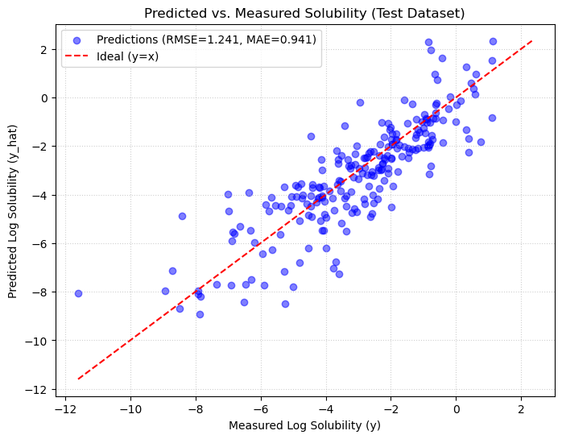
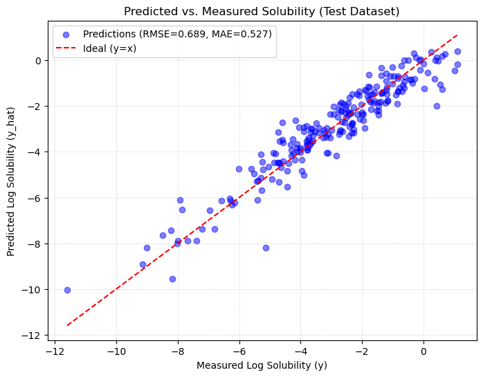
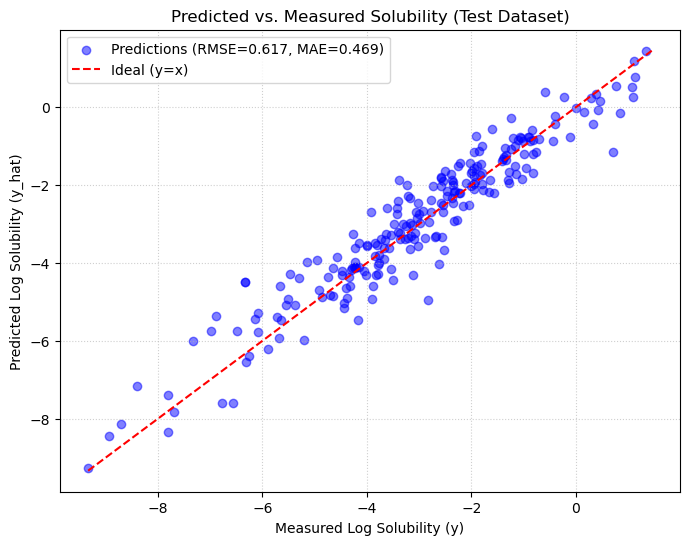
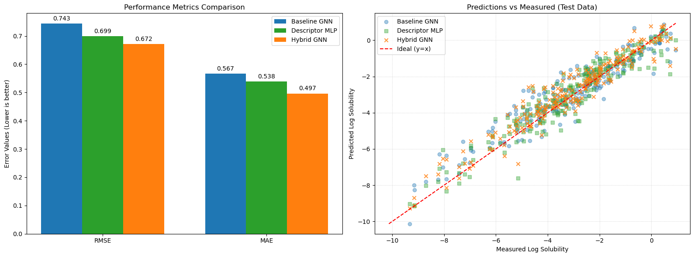

# ESOL-Solubility-Prediction: A Comparative Study of ML & GNN
# ESOL 溶解度预测：机器学习与图神经网络的对比研究

## 🔬 Project Overview | 项目概览
This project is an **AI4Science** exploration focused on predicting aqueous solubility ($\log S$) using the **ESOL (Delaney)** dataset. The core objective is to evaluate the synergy between traditional chemical domain knowledge (Expert Descriptors) and modern representation learning (Graph Neural Networks)

本项目是一个 **AI4Science** 探索项目，旨在利用 **ESOL (Delaney)** 数据集预测分子的水溶性 ($\log S$)。核心目标是评估传统化学领域知识（专家描述符）与现代表征学习（图神经网络）之间的协同作用。

---

## 📂 Modules | 模块说明

### 1. Feature Engineering | 特征工程 (`feature_get.ipynb`)
Extracts multi-scale chemical information using **RDKit**:

利用 **RDKit** 提取多尺度化学信息：
* **Graph Features**: Atomic connectivity states and corresponding atomic properties:  atomic number, degree and aromaticity（**Max-Min Normalization**）.
  
  **图特征**：原子连接状态与对应原子的原子序数、度数、芳香性（**Max-Min 归一化**）。
  
* **Expert Descriptors**: Calculation of MolLogP (hydrophobicity), TPSA, Molecular Weight, and Valence Electrons, followed by **Max-Min Normalization**.
  
  **专家描述符**：计算 MolLogP（脂水分配系数）、TPSA、分子量、价电子数等，并进行 **Max-Min 归一化**。
  
* **Data Packaging**: Encapsulating data for use in subsequent sections.
  
  **数据封装**：将数据封装供后续部分使用。

### 2. Machine Learning Baselines | 机器学习基准 (`ML.ipynb`)

Establishes performance benchmarks using classical algorithms on 1D expert features:

利用经典算法在 1D 专家特征上建立性能基准：

* **Models**: **Random Forest (RF)** and **XGBoost**.
  
  **模型**：**随机森林 (RF)** 与 **XGBoost**。
  
* **Insight**: Assessing the predictive power of physicochemical descriptors.
  
  **洞察**：评估物理化学描述符的预测能力。

### 3. Neural Network Architecture Exploration | 神经网络架构探索 (`MLP.ipynb` & `GNN.ipynb` & `Hybrid_GNN.ipynb`)

Investigates different deep learning approaches for solubility prediction:

研究用于溶解度预测的不同深度学习方法：

* **MLP**: Multilayer perceptron prediction based on physicochemical descriptors..
  
  **MLP**：基于物理化学描述符的多层感知机预测。
  
* **GNN**: Graph Convolutional Network prediction based on molecular graph features.

  **GNN**：基于分子图特征的图卷积网络预测
  
* **Hybrid GNN**: Implementing a **GCN** (Graph Convolutional Network) architecture that fuses learned graph embeddings with physicochemical properties.
  
  **混合 GNN**：实现基于 **GCN**（图卷积网络）的架构，将学习到的图嵌入与物理化学特征进行融合。

---

## 💡 Key Insights | 核心发现

By comparing model performances across different solubility ranges, we observed a significant **Synergistic Effect** in the Hybrid GNN architecture:

通过对比不同溶解度范围的模型表现，我们在混合 GNN 架构中观察到了显著的**协同效应**：

### **Limitations of Single Approaches | 单一方法的局限性**:
  * **Pure GNN ($\log S < -6$)**: Struggled with poorly soluble molecules. Without explicit physical constraints, structural embeddings alone failed to capture the extreme hydrophobic effects of large, rigid aromatic systems.
      
    **纯 GNN ($\log S < -6$)**：在难溶分子上表现较差。在缺乏显式物理约束的情况下，仅靠结构嵌入难以捕捉大型刚性芳香体系的极端疏水效应。

  

  * **Expert Descriptors ($\log S > 0$)**: Showed higher error rates for highly soluble molecules. Simple physicochemical averages (like LogP) lack the structural granularity to account for specific solvation and hydrogen bonding patterns.(The sample size for highly soluble molecules is relatively small; a clear trend can be observed in the upper-right portion above the ideal line where predicted values tend to avoid exceeding 0)
      
    **专家描述符 ($\log S > 0$)**：在高溶分子上误差较大。简单的理化加和（如 LogP）缺乏足够的结构细粒度来描述特定的溶剂化效应和氢键模式。（高溶分子样本量较少，在理想线右上部分可看到预测值有避免大于0的趋势）

  

  

### **The Hybrid Advantage | 混合模型的优势**:
* **Fusion Logic**: The Hybrid GNN fuses global **Physicochemical Descriptors** with local **Graph Embeddings**.
      
   **融合逻辑**：混合 GNN 将全局**物理化学描述符**与局部**图嵌入**相结合。
* **Synergy**: Descriptors provide a "physical floor" for hydrophobicity (improving low solubility prediction), while the GNN captures subtle structural variations (refining high solubility prediction), leading to robust performance across the entire range.
      
   **协同效应**：描述符为疏水性提供了“物理底线”（优化了低溶解度预测），而 GNN 捕捉了微妙的结构变化（细化了高溶解度预测），从而实现了全量程的鲁棒表现。

  

---

## 🧪 Ablation Studies | 消融实验

To validate the contribution of specific components within our architecture and data processing pipeline, we conducted ablation studies:

为了验证架构和数据处理流程中特定组件的贡献，我们进行了消融实验：

###  Feature Source Ablation (GNN vs. MLP vs. Hybrid) | 特征源消融
By isolating the feature sources:
* **Only Graph Features (GNN)**: Failed to capture explicit global thermodynamic properties like LogP, leading to poor predictions for highly insoluble compounds.
* **Only Expert Descriptors (MLP)**: Lacked the structural topology information needed to distinguish complex spatial configurations or specific hydrogen-bond networks.
* **Conclusion**: The hybrid approach (Graph + Descriptors) is strictly necessary to bridge the gap between microscopic structural variations and macroscopic physicochemical properties.

  通过隔离特征源：
* **仅图特征 (GNN)**：未能捕捉 LogP 等显式的全局热力学属性，导致极难溶化合物的预测效果差。
* **仅专家描述符 (MLP)**：缺乏区分复杂空间构型或特定氢键网络所需的拓扑结构信息。
* **结论**：混合方法（图特征 + 描述符）对于弥合微观结构变化与宏观理化性质之间的鸿沟是必不可少的。

* **结果**：
  
**纯GNN Baseline**:  RMSE: 0.7433, MAE: 0.5670

**纯描述符 MLP**:  RMSE: 0.6987, MAE: 0.5384

**混合特征 Hybrid**: RMSE: 0.6718, MAE: 0.4965

  

---

## 🛠️ Tech Stack | 技术栈
* **Cheminformatics (化学信息学)**: RDKit
* **Deep Learning (深度学习)**: PyTorch, PyTorch Geometric (PyG)
* **Machine Learning (机器学习)**: Scikit-learn, XGBoost
* **Data Science (数据科学)**: Pandas, NumPy, Matplotlib
